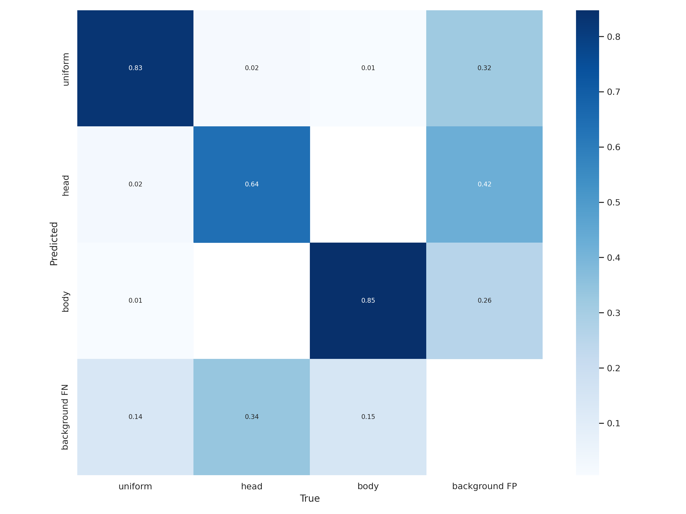
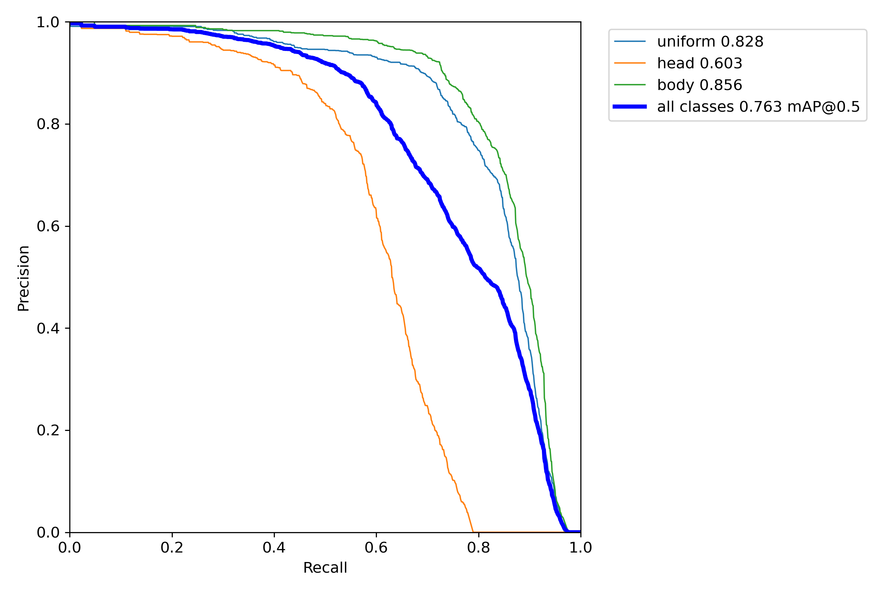
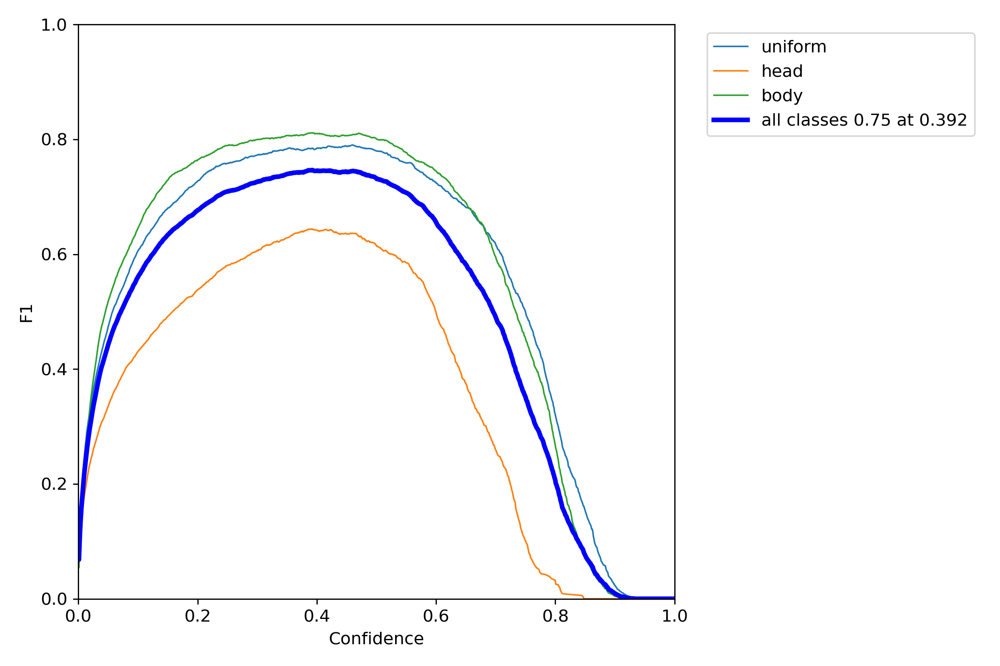
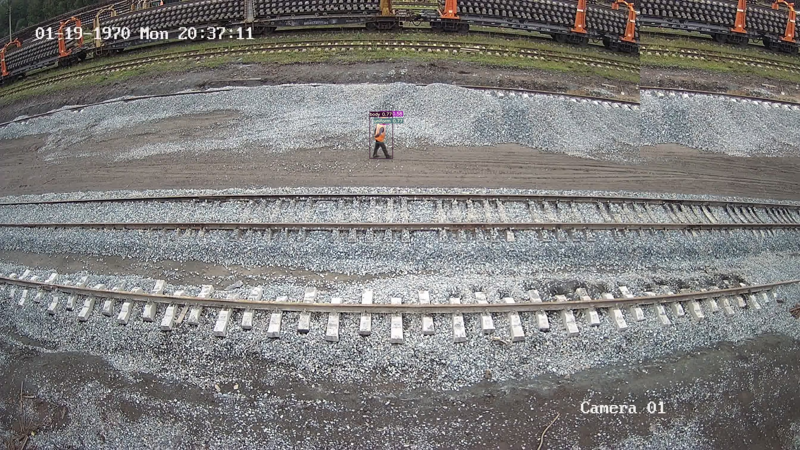

# Custom YOLO dataset object detection
All the steps of this task are mentioned in [this notebook](YOLO_od.ipynb) as the model was trained in Google Colab. Here you take a closer look at the metrics and object detection examples.
### Data preparation
In order to train a new model the dataset was splitted into train and validation subsets (80 and 20 percent respectively).
*Fiftyone* tool was used to visualize annotations and get the class names.
### Training
YOLOv7 was used to get a custom data model.
> I apologize in advance if newer versions of yolo frameworks were prohibited, though v7 performes better and works nice and smooth with this data format.

Training folder contains necessary data and the resulting weights.
### Testing the model
Embedded testing script was used to evaluate the model and visualize essential metrics.

### Visualizing the results
As the list of class names was assigned when preparing the dataset, we can see the real names of detected objects (some of the labels are overlayed but we can see the difference as the bounding boxes are color coded).

